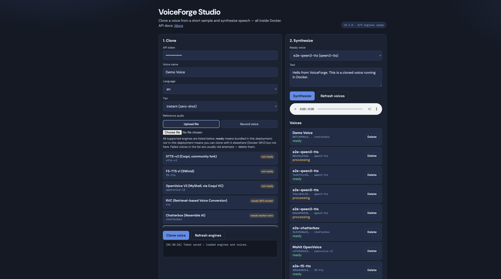

# VoiceForge

[](https://github.com/mohitkale/voiceforge/actions/workflows/ci.yml)
[](LICENSE)

**Clone a voice locally. Generate speech privately.**

VoiceForge is a self-hosted voice cloning studio and API: record or upload a
short sample, create a reusable voice, and synthesize speech with **multiple
local engines** — switching engines without rebuilding your workflow.

Self-hosted by design. Run it on your workstation, private server, or GPU
environment. Voice samples and generated audio go only to the infrastructure
you choose. No cloud TTS account. No per-character billing.

> **Project status: Early public release**
>
> The local Studio, API, engine registry, Docker setup, and supported cloning
> workflows are available. Engine installation, quality, and hardware
> requirements vary, and some integrations still need broader hardware testing.
> Milestone history lives in [ROADMAP.md](ROADMAP.md).

**VoiceForge application code is MIT licensed. Each speech engine and model has
its own terms** — see [NOTICE.md](NOTICE.md) and
[docs/ENGINE_LICENSING.md](docs/ENGINE_LICENSING.md).

## Studio



[First clone guide](docs/FIRST_CLONE.md) ·
[Engine matrix](docs/ENGINES.md) ·
[Demo capture](docs/DEMO_CAPTURE.md) ·
[Clone flow diagram](docs/clone-flow.svg)

### Audio examples

Engine comparison audio should be generated by a running VoiceForge instance
(same synthetic reference + neutral sentence). Captured samples are listed in
[docs/assets/AUDIO_SOURCES.md](docs/assets/AUDIO_SOURCES.md).

| Engine | Hardware | Sample | Notes |
|--------|----------|--------|-------|
| OpenVoice V2 | CPU friendly | *capture pending* | Fast local starting point |
| F5-TTS | GPU preferred | *capture pending* | Higher resource use |
| XTTS-v2 | GPU preferred | *capture pending* | Model licence restrictions (CPML) |
| Qwen3-TTS / Chatterbox | GPU preferred | *capture pending* | Extra install / worker |

Do not treat any engine as universally “best” — quality depends on sample,
language, and hardware. See [DEMO_CAPTURE.md](docs/DEMO_CAPTURE.md) to produce
verified WAVs/MP3s for this table.


## How it works

1. **Choose an engine** (`openvoice-v2` recommended on CPU).
2. **Upload or record** a short reference clip.
3. **Confirm consent** (Studio checkbox / API `consent=true`).
4. **Clone** — VoiceForge builds a reusable voice artifact.
5. **Synthesize** text → WAV on your infrastructure.
6. **Delete** the voice anytime (`DELETE /v1/voices/{id}` removes samples + artifacts).

```
Client (Studio · curl · Reel Studio · your app)
        │  HTTP (+ SSE progress)
        ▼
VoiceForge API  →  selected CloneEngine  →  WAV
```

## Responsible use

Clone **only** your own voice or a voice for which you have clear permission.

VoiceForge requires an explicit consent acknowledgement when creating a voice,
but software **cannot** independently verify ownership or legal authority.
Operators are responsible for obtaining and retaining valid permission.

Do **not** use VoiceForge for impersonation, fraud, harassment, bypassing
identity verification, or misleading people about the origin of audio.

Optional watermarking is a weak fingerprint — not tamper-proof detection.
Details: [RESPONSIBLE_USE.md](RESPONSIBLE_USE.md) ·
[docs/CONSENT.md](docs/CONSENT.md) ·
[docs/WATERMARKING.md](docs/WATERMARKING.md).

## Supported engines

### Easiest starting point

- **`openvoice-v2`** — lightest zero-shot path on CPU; CPU e2e verified

### Higher-quality / heavier zero-shot

- `f5-tts`, `xtts-v2` (CPML non-commercial), `chatterbox`, `qwen3-tts`

### Advanced / externally managed

- `rvc` (GPU + training), `fish-speech` (self-hosted sidecar),
  `cosyvoice-3`, `indextts-2`

Full matrix (CPU/GPU, Docker defaults, licences, verification labels):
**[docs/ENGINES.md](docs/ENGINES.md)**.

| Engine | Clone type | CPU | GPU | Default CPU image | Licence note | Verification |
|--------|------------|-----|-----|-------------------|--------------|--------------|
| `openvoice-v2` | Zero-shot | Yes | Yes | Yes | MIT VC + verify YourTTS base | Verified (CPU e2e) |
| `f5-tts` | Zero-shot | Slow | Recommended | Yes | Apache-2.0 / CC (upstream) | Verified (CPU e2e) |
| `xtts-v2` | Zero-shot | Slow | Recommended | Yes | **CPML non-commercial** | Verified (CPU e2e) |
| `chatterbox` | Zero-shot | Worker | Optional | Yes (worker venv) | MIT | Smoke-documented |
| `qwen3-tts` | Zero-shot | Limited | Recommended | Yes | Apache-2.0 | Smoke-documented |
| `rvc` | Trained | No | Required | No (GPU image) | MIT architecture | GPU verification needed |
| `fish-speech` | Sidecar | Depends | Recommended | External | Check upstream | External sidecar |
| `cosyvoice-3` | Zero-shot | Limited | Recommended | Extra install | Apache-2.0 | GPU verification needed |
| `indextts-2` | Zero-shot | Limited | Recommended | Extra install | Check upstream | GPU verification needed |

GPU Docker paths were written carefully but **not** run against real NVIDIA
hardware during development — please verify on your host.

## Quick start

```bash
cp .env.example .env
# Optional: set VOICEFORGE_API_TOKEN if you will expose beyond localhost.

make start-cpu
# equivalent:
# docker compose -f docker/docker-compose.yml --profile cpu up --build
```

| URL | What |
|-----|------|
| **http://localhost:8089/** | **Studio** — engine picker, upload/record, consent, clone, synth |
| http://localhost:8089/docs | OpenAPI |
| http://localhost:8089/healthz | Liveness |

After the first build, `make start-cpu` (or compose `up` without `--build`) is
enough. Helpers: `make stop`, `make logs`, `make smoke-openvoice`.

Compose caps the CPU service at **4 CPUs / 6 GB RAM** by default. Data → `./data`;
weights → `models-cache` Docker volume.

**First clone:** follow **[docs/FIRST_CLONE.md](docs/FIRST_CLONE.md)**
(sample length, quiet room, expected download time, deletion).

```bash
# Optional model pre-download:
docker compose -f docker/docker-compose.yml --profile cpu run --rm voiceforge-download

# GPU (NVIDIA Container Toolkit — not typical on Mac):
# make start-gpu
```

### CPU vs GPU

| | CPU | GPU |
|---|-----|-----|
| Best for | Laptops, cheap VPS, first clone (`openvoice-v2`) | Heavier engines, RVC, faster synth |
| Verified here | CPU e2e for openvoice-v2, xtts-v2, f5-tts | Image exists; **real-GPU verification still needed** |

## Studio usage

1. Open http://localhost:8089/
2. Paste `VOICEFORGE_API_TOKEN` only if the API requires it (localhost can be open)
3. Select **openvoice-v2**, upload/record, check **consent**, clone
4. Synthesize and play; delete voices you no longer need

## API usage

When `VOICEFORGE_API_TOKEN` is set, send `Authorization: Bearer <token>` on `/v1/*`.

```bash
curl -s -X POST http://localhost:8089/v1/voices \
  -F "name=Demo Clone" \
  -F "engine_id=openvoice-v2" \
  -F "tier=instant" \
  -F "consent=true" \
  -F "language=en" \
  -F "files=@sample.wav"

curl -s -X POST http://localhost:8089/v1/synthesize \
  -H "Content-Type: application/json" \
  -d '{"voiceId":"<id>","text":"Hello from VoiceForge."}' \
  -o out.wav
```

```
GET  /healthz
GET  /v1/engines
POST /v1/voices          # consent=true required
GET  /v1/voices/{id}/events   # SSE progress
DELETE /v1/voices/{id}   # deletes samples + artifacts
POST /v1/synthesize      # → audio/wav
GET  /v1/metrics
```

Interactive docs: `/docs`. Configuration: `.env.example` (`VOICEFORGE_*`).

## Reel Studio integration

VoiceForge stays audio-only. Reel Studio (or any client) calls HTTP:

```
Reel Studio → VoiceForge API → local engine → WAV
```

See **[docs/REEL_STUDIO.md](docs/REEL_STUDIO.md)**. VoiceForge remains usable with
curl, Studio, and other apps without Reel Studio.

## Security and self-hosting

- Bearer auth when token configured; CORS allowlist; upload sniffing; path-safe
  storage; job concurrency caps; non-root Docker; pinned deps
- Full guide: **[docs/SELF_HOSTING.md](docs/SELF_HOSTING.md)**
- Report vulnerabilities privately: **[SECURITY.md](SECURITY.md)**

## Watermarking

Optional (`VOICEFORGE_WATERMARK_ENABLED`, default **false**): mixes a quiet,
voice-id-seeded noise fingerprint into synth WAVs. Not forensic proof; not a
substitute for consent. **[docs/WATERMARKING.md](docs/WATERMARKING.md)**

## Architecture


Single FastAPI process, SQLite metadata, `data/` for samples/artifacts. Optional
engines run in isolated workers or a Fish Speech sidecar when dependency pins
conflict.

### `CloneEngine` interface

```python
class CloneEngine(Protocol):
    id: str
    label: str
    capabilities: CloneCapabilities

    def is_ready(self) -> bool: ...
    async def create_voice(self, voice_id, sample_paths, tier, language, on_progress=None) -> VoiceArtifact: ...
    async def synthesize(self, voice_id, artifact, text, opts) -> bytes: ...
```

Adding an engine = one file in `app/engines/` + one entry in
`app/engines/registry.py`.

## Roadmap

See **[ROADMAP.md](ROADMAP.md)** (completed M0–M8 + next ideas).

## Contributing

See **[CONTRIBUTING.md](CONTRIBUTING.md)** and **[CODE_OF_CONDUCT.md](CODE_OF_CONDUCT.md)**.
Issue/PR templates live under `.github/`.

## Licensing

- **Application code:** MIT (`LICENSE`)
- **Engines / weights:** vary — **[NOTICE.md](NOTICE.md)**,
  **[docs/ENGINE_LICENSING.md](docs/ENGINE_LICENSING.md)**
- XTTS-v2 weights are **CPML non-commercial / research**; set `COQUI_TOS_AGREED=1`
  for non-interactive download only after you accept those terms

## Documentation index

| Doc | Topic |
|-----|-------|
| [FIRST_CLONE.md](docs/FIRST_CLONE.md) | First successful clone |
| [ENGINES.md](docs/ENGINES.md) | Support matrix |
| [ENGINE_LICENSING.md](docs/ENGINE_LICENSING.md) | Licence matrix |
| [RESPONSIBLE_USE.md](RESPONSIBLE_USE.md) / [CONSENT.md](docs/CONSENT.md) | Safety & consent |
| [WATERMARKING.md](docs/WATERMARKING.md) | Fingerprint limitations |
| [SELF_HOSTING.md](docs/SELF_HOSTING.md) | Deploy securely |
| [REEL_STUDIO.md](docs/REEL_STUDIO.md) | Client integration |
| [DEMO_CAPTURE.md](docs/DEMO_CAPTURE.md) | Screenshots & audio |
| [GITHUB_METADATA.md](docs/GITHUB_METADATA.md) | Topics / social preview |
| [deploy-modal.md](docs/deploy-modal.md) / [Lightning](docs/deploy-lightning.md) / [Kaggle](docs/deploy-kaggle.md) | GPU cloud |
| [local-python-setup.md](docs/local-python-setup.md) | Host Python / Modal CLI |

## Development

```bash
python3.11 -m venv .venv && source .venv/bin/activate
pip install -e ".[dev]"
pytest
ruff check app tests scripts
pip-audit
docker compose -f docker/docker-compose.yml config
```

Unit tests use a `FakeEngine` (no multi-GB downloads). Optional ML extras are
in `requirements-*.txt` / `pyproject.toml` optional deps.

## Repo layout

```
voiceforge/
├── app/           # FastAPI, engines, Studio static UI
├── docs/          # Guides + assets
├── docker/        # CPU/GPU images + compose
├── scripts/       # download, workers, e2e smoke
├── tests/
├── data/          # gitignored runtime data
└── models/        # gitignored checkpoints
```
